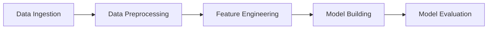

# Spam Detection MLOps Pipeline

[](https://opensource.org/licenses/MIT)
[](https://www.python.org/downloads/)
[](https://dvc.org/)

End-to-end MLOps pipeline for NLP-based spam detection using Python, DVC, and AWS S3 with experiment tracking and reproducible workflows.

## Table of Contents

- [Overview](#overview)
- [Features](#features)
- [Project Structure](#project-structure)
- [Pipeline Architecture](#pipeline-architecture)
- [Installation](#installation)
- [Usage](#usage)
- [Experiment Tracking](#experiment-tracking)
- [DVC Pipeline](#dvc-pipeline)
- [Configuration](#configuration)
- [Results](#results)
- [Contributing](#contributing)
- [License](#license)

## Overview

This project implements a production-ready MLOps pipeline for spam detection using Natural Language Processing (NLP) techniques. The pipeline leverages **DVC (Data Version Control)** for reproducible machine learning workflows, **DVCLive** for experiment tracking, and **AWS S3** for remote data storage.

The system classifies text messages as spam or ham (legitimate) using a Random Forest classifier trained on TF-IDF features extracted from preprocessed text data.

## Features

- **Automated ML Pipeline**: End-to-end automation from data ingestion to model evaluation
- **Experiment Tracking**: Track metrics, parameters, and model performance with DVCLive
- **Reproducibility**: Version control for data, models, and experiments using DVC
- **Cloud Storage**: Remote storage integration with AWS S3
- **Comprehensive Logging**: Detailed logging for debugging and monitoring
- **Parameterization**: Centralized configuration management via `params.yaml`
- **NLP Processing**: Advanced text preprocessing with NLTK (tokenization, stemming, stopword removal)
- **Model Evaluation**: Multiple metrics including accuracy, precision, recall, and AUC-ROC

## Project Structure

```
spam-detection-mlops-pipeline/
│
├── .dvc/                       # DVC configuration and cache
│   └── config                  # Remote storage configuration (AWS S3)
│
├── data/                       # Data directory (tracked by DVC)
│   ├── raw/                    # Raw train/test splits
│   ├── interim/                # Preprocessed data
│   └── processed/              # Feature-engineered data (TF-IDF)
│
├── src/                        # Source code
│   ├── data_ingestion.py       # Load and split data
│   ├── data_preprocessing.py   # Text cleaning and normalization
│   ├── feature_engineering.py  # TF-IDF vectorization
│   ├── model_building.py       # Train Random Forest classifier
│   └── model_evaluation.py     # Evaluate and log metrics
│
├── models/                     # Trained models (tracked by DVC)
│   └── model.pkl               # Serialized Random Forest model
│
├── reports/                    # Evaluation reports
│   └── metrics.json            # Model performance metrics
│
├── logs/                       # Application logs
│   ├── data_ingestion.log
│   ├── data_preprocessing.log
│   ├── feature_engineering.log
│   ├── model_building.log
│   └── model_evaluation.log
│
├── dvclive/                    # DVCLive experiment tracking
│   ├── metrics.json            # Tracked metrics
│   ├── params.yaml             # Logged parameters
│   └── plots/                  # Visualization plots
│
├── experiments/                # Jupyter notebooks for exploration
│   └── mynotebook.ipynb
│
├── docs/                       # Documentation
│   └── workflow.md             # MLOps workflow guide
│
├── dvc.yaml                    # DVC pipeline definition
├── dvc.lock                    # DVC pipeline lock file
├── params.yaml                 # Hyperparameters and configuration
├── requirements.txt            # Python dependencies
├── .gitignore                  # Git ignore rules
├── .dvcignore                  # DVC ignore rules
├── LICENSE                     # MIT License
└── README.md                   # This file
```

> **Note**: Directories marked with comments are generated during pipeline execution:
> - `data/`, `models/`, `reports/` - Tracked by DVC (not in Git, pulled via `dvc pull`)
> - `logs/`, `dvclive/` - Generated at runtime (gitignored)
> - To reproduce the full structure, run `dvc pull` followed by `dvc repro`

## Pipeline Architecture

The pipeline consists of five sequential stages:



### Stage Details

| Stage | Script | Input | Output | Description |
|-------|--------|-------|--------|-------------|
| **1. Data Ingestion** | `data_ingestion.py` | Raw CSV from URL | `data/raw/` | Downloads dataset, performs train/test split |
| **2. Data Preprocessing** | `data_preprocessing.py` | `data/raw/` | `data/interim/` | Text cleaning, tokenization, stemming, stopword removal |
| **3. Feature Engineering** | `feature_engineering.py` | `data/interim/` | `data/processed/` | TF-IDF vectorization with configurable max features |
| **4. Model Building** | `model_building.py` | `data/processed/` | `models/model.pkl` | Trains Random Forest classifier |
| **5. Model Evaluation** | `model_evaluation.py` | `models/model.pkl` | `reports/metrics.json` | Evaluates model and logs metrics |

## Installation

### Prerequisites

- Python 3.8 or higher
- pip package manager
- Git
- AWS account (for S3 remote storage)

### Setup

1. **Clone the repository**
   ```bash
   git clone https://github.com/u-faizan/spam-detection-mlops-pipeline.git
   cd spam-detection-mlops-pipeline
   ```

2. **Create a virtual environment**
   ```bash
   python -m venv ml_venv
   
   # On Windows
   ml_venv\Scripts\activate
   
   # On macOS/Linux
   source ml_venv/bin/activate
   ```

3. **Install dependencies**
   ```bash
   pip install -r requirements.txt
   ```

4. **Download NLTK data**
   ```python
   python -c "import nltk; nltk.download('stopwords'); nltk.download('punkt'); nltk.download('punkt_tab')"
   ```

5. **Configure AWS credentials** (for S3 remote storage)
   ```bash
   # Set up AWS credentials
   aws configure
   ```

6. **Initialize DVC** (if not already initialized)
   ```bash
   dvc init
   ```

## Usage

### Running the Complete Pipeline

Execute the entire pipeline with a single command:

```bash
dvc repro
```

This will run all stages in the correct order, skipping stages whose dependencies haven't changed.

### Running Individual Stages

You can also run individual Python scripts:

```bash
# Data ingestion
python src/data_ingestion.py

# Data preprocessing
python src/data_preprocessing.py

# Feature engineering
python src/feature_engineering.py

# Model building
python src/model_building.py

# Model evaluation
python src/model_evaluation.py
```

### Visualizing the Pipeline

View the pipeline DAG (Directed Acyclic Graph):

```bash
dvc dag
```

## Experiment Tracking

This project uses **DVCLive** for experiment tracking. Each experiment run logs:

- **Metrics**: accuracy, precision, recall, AUC-ROC
- **Parameters**: hyperparameters from `params.yaml`
- **Plots**: performance visualizations

### Running Experiments

```bash
# Run a new experiment
dvc exp run

# View all experiments
dvc exp show

# Compare experiments
dvc exp diff [experiment-name]

# Apply a specific experiment
dvc exp apply [experiment-name]

# Remove an experiment
dvc exp remove [experiment-name]
```

### Experiment Workflow

1. Modify parameters in `params.yaml`
2. Run `dvc exp run`
3. Review results with `dvc exp show`
4. Iterate and compare experiments

## DVC Pipeline

The pipeline is defined in `dvc.yaml`:

### Pipeline Configuration

```yaml
stages:
  data_ingestion:
    cmd: python src/data_ingestion.py
    deps:
      - src/data_ingestion.py
    params:
      - data_ingestion.test_size
    outs:
      - data/raw

  data_preprocessing:
    cmd: python src/data_preprocessing.py
    deps:
      - data/raw
      - src/data_preprocessing.py
    outs:
      - data/interim

  feature_engineering:
    cmd: python src/feature_engineering.py
    deps:
      - data/interim
      - src/feature_engineering.py
    params:
      - feature_engineering.max_features
    outs:
      - data/processed

  model_building:
    cmd: python src/model_building.py
    deps:
      - data/processed
      - src/model_building.py
    params:
      - model_building.n_estimators
      - model_building.random_state
    outs:
      - models/model.pkl

  model_evaluation:
    cmd: python src/model_evaluation.py
    deps:
      - models/model.pkl
      - src/model_evaluation.py
    metrics:
      - reports/metrics.json
```

### Remote Storage

The pipeline uses AWS S3 for remote storage:

```bash
# Push data and models to remote storage
dvc push

# Pull data and models from remote storage
dvc pull
```

## Configuration

All hyperparameters are centralized in `params.yaml`:

```yaml
data_ingestion:
  test_size: 0.20

feature_engineering:
  max_features: 50

model_building:
  n_estimators: 20
  random_state: 2
```

### Modifying Parameters

1. Edit `params.yaml` with your desired values
2. Run `dvc repro` to execute the pipeline with new parameters
3. DVC will automatically detect changes and re-run affected stages

## Results

The model evaluation produces the following metrics (stored in `reports/metrics.json`):

- **Accuracy**: Overall classification accuracy
- **Precision**: Proportion of true positives among predicted positives
- **Recall**: Proportion of true positives among actual positives
- **AUC-ROC**: Area under the ROC curve

### Viewing Results

```bash
# View metrics
cat reports/metrics.json

# View DVCLive metrics
cat dvclive/metrics.json

# View experiment comparison
dvc exp show
```

## Technology Stack

- **Python**: Core programming language
- **scikit-learn**: Machine learning algorithms and metrics
- **NLTK**: Natural language processing
- **pandas**: Data manipulation
- **NumPy**: Numerical computing
- **DVC**: Data and pipeline versioning
- **DVCLive**: Experiment tracking
- **AWS S3**: Remote storage
- **PyYAML**: Configuration management

## Documentation

For detailed workflow and best practices, see:

- [MLOps Pipeline & Experiment Workflow](docs/workflow.md)

## Contributing

Contributions are welcome! Please follow these steps:

1. Fork the repository
2. Create a feature branch (`git checkout -b feature/amazing-feature`)
3. Commit your changes (`git commit -m 'Add amazing feature'`)
4. Push to the branch (`git push origin feature/amazing-feature`)
5. Open a Pull Request

## License

This project is licensed under the MIT License - see the [LICENSE](LICENSE) file for details.

## Author

**Umar Faizan**

- GitHub: [@u-faizan](https://github.com/u-faizan)

## Acknowledgments

- Dataset: [SMS Spam Collection Dataset](https://raw.githubusercontent.com/u-faizan/datasets/refs/heads/main/spam.csv)
- DVC Documentation: [dvc.org](https://dvc.org/)
- scikit-learn Documentation: [scikit-learn.org](https://scikit-learn.org/)

---

⭐ **If you find this project helpful, please consider giving it a star!**
